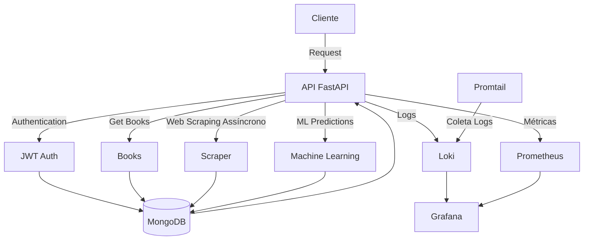

# API Tech Challenger

This project is an API built with FastAPI that provides machine learning, asynchronous web scraping, and JWT authentication functionalities, with complete monitoring using Prometheus, Grafana, and Loki.

## Diagrama da Arquitetura



## Prerequisites

- Docker
- Docker Compose
- Git

## Getting Started

1. Clone the repository:
```bash
git clone <repository-url>
cd api-tech-challenger
```

2. Configure environment variables:
```bash
cp .env.example .env
```

Edit the `.env` file with your own credentials and configuration:

```env
USER_MONGODB=seu_usuario
PASS_MONGODB=sua_senha
PROMETHEUS_PORT=9090
GRAFANA_PORT=3000
LOKI_PORT=3100
```

3. Start the containers with Docker Compose:
```bash
docker compose up -d
```

Once started, the API will be available at `http://localhost:8081`

## Endpoints da API

### Authentication

- **POST** `/api/v1/auth/register`
  - Registers a new user
  - Body: 
    ```json
    {
        "username": "string",
        "email": "string",
        "password": "string",
        "full_name": "string"
    }
    ```

- **POST** `/api/v1/auth/login`
  - Authenticates a user and returns a JWT token
  - Body:
    ```json
    {
        "username": "string",
        "password": "string"
    }
    ```

### Books

- **GET** `/api/v1/books`
  - Retrieves a paginated list of all books
  - Query Parameters:
    - `page`: page number
    - `limit`: number of items per page
    - `catalog`: filter by category
    - `min_price`: prminimum price
    - `max_price`: maximum price

- **GET** `/api/v1/books/{id}`
  - Retrieves details for a specific book

- **GET** `/api/v1/categories/`
  - Returns all registered categories

- **GET** `/api/v1/stats/categories/`
  - Returns category statistics including
    - Category name
    - Total number of books
    - Average price
    - Minimum and maximum prices
    - Total stock

### Statistics

- **GET** `/api/v1/books/stats/overview`
  - Returns general book statistics
    - Total books
    - Average prices
    - Total categories
    - Distribution by category
    - Price ranges

- **GET** `/api/v1/health`
    - Checks API and database connection status.
    - Returns basic system metrics.

### Web Scraping (Assíncrono)

- **POST** `/api/v1/scrapping`
    - Starts an asynchronous web scraping job.
    - Requires JWT Authentication
    - Uses aiohttp for async requests
    - Processes multiple pages concurrently
    - Supports configurable concurrency limits
    - Body:
        ```json
        {
            "max_concurrent": 10,
            "categories": ["Travel", "Mystery", "Historical Fiction"]
        }
        ```

### Machine Learning

- **POST** `/api/v1/ml/predict`
    - Performs predictions using the trained model.
    - Requires JWT Authentication.
    - Body:
        ```json
        {
            "features": [
                {
                    "sepal_length": 5.1,
                    "sepal_width": 3.5,
                    "petal_length": 1.4,
                    "petal_width": 0.2
                }
            ]
        }
        ```

- **GET** `/api/v1/ml/model-info`
    - Returns metadata about the current ML model


## Testes

To run API tests:

```bash
# No ambiente local
python3 test/test_api.py

# Ou dentro do container
docker compose exec api-tech-challenger python3 test/test_api.py
```

Test coverage includes:
    - User registration
    - Authentication
    - Protected routes
    - Machine Learning endpoints
    - Asynchronous Web Scraping
    - CRUD operations for Books

## Monitoramento

### Prometheus
- Access metrics at: `http://localhost:9090`
- Collects metrics from API and MongoDB

### Grafana
- Dashboard: `http://localhost:3000`
- Default credentials: admin/admin
- Pre-configured dashboards for:
  - API metrics
  - MongoDB performance
  - Application logs

### Loki
- Endpoint: `http://localhost:3100`
- Centralized log aggregation
- Integrated with Promtail for log collection
- View logs via Grafana
- Collects:
  - API logs
  - MongoDB logs
  - Web Scraping logs
  - Machine Learning logs

## Stack Tecnológica

- **Backend**: FastAPI
- **Database**: MongoDB
- **Machine Learning**: scikit-learn
- **Web Scraping**: aiohttp + BeautifulSoup4
- **Authentication**: JWT
- **Containerization**: Docker
- **Observability**: 
  - Prometheus (Metrics)
  - Grafana (Dashboard)
  - Loki + Promtail (Logs)